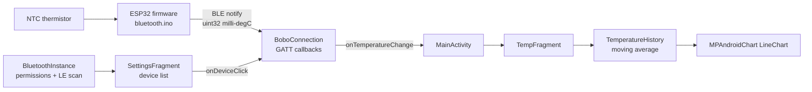

# Smarcifier — Thermo Bo-Bo

*An Android app and ESP32 firmware pair that streams live body-temperature readings over Bluetooth Low Energy.*

Smarcifier is the software half of **Thermo Bo-Bo**, a small wearable thermometer built around an ESP32-S2 board and an NTC thermistor. The firmware exposes the measured temperature as a single BLE GATT characteristic and notifies subscribers whenever the value changes; the Kotlin Android app (`Thermo-Bobo`) scans for the device, subscribes, smooths the readings and plots them on a live chart. The repository also keeps the throw-away Bluetooth LE spike project and the serial-port debugging scripts that were used while bringing the hardware up.

## Overview

- 📡 **BLE client** — discovers nearby devices, connects via GATT, subscribes to temperature notifications.
- 📈 **Live chart** — a rolling 20-point line chart with a formatted `HH:mm:ss` time axis.
- 🌡️ **Smoothing** — readings are averaged over a 5-sample moving window before being displayed.
- 🧭 **Drawer navigation** — three destinations (Temperature, Alarm, Settings) driven by Navigation Component.
- 🔌 **Firmware** — an Arduino/ESP32 BLE server that re-advertises automatically after a disconnect.
- 🛠️ **Bring-up tools** — Python serial readers used to sanity-check the thermistor before BLE existed.

## Architecture



The device advertises service `bbbaa765-0507-423a-9494-9cfd4d7e86fb` with the temperature characteristic
`673eb6f3-1af4-48db-83ac-dd9d3b0c5950`. Values arrive as a 4-byte little-endian unsigned integer in
milli-degrees Celsius and are multiplied by `0.001f` on the client.

`BluetoothInstance` walks the Android permission dance step by step (request `BLUETOOTH_CONNECT`, request
`BLUETOOTH_SCAN`, then prompt the user to enable the adapter), re-entering itself after every
`ActivityResult` until the LE scanner is available. Scans stop automatically after a 30-second timeout.

## Screens

| Destination | Fragment | What it does |
|---|---|---|
| Temperature (start) | `ui/temp/TempFragment` | Shows the current smoothed value and the rolling line chart. Displays *"Connect to your Bo-Bo to see a measurement"* when no data has arrived. |
| Alarm | `ui/alarm/AlarmFragment` | Two inputs for a high and low temperature threshold; the confirm button currently only echoes the values in a toast. |
| Settings | `ui/settings/SettingsFragment` | Initialises the Bluetooth stack, scans for LE devices and lists them as connect buttons. |

## Tech Stack

| Area | Choice |
|---|---|
| Language | Kotlin (JVM target 1.8) |
| Build | Gradle 7.5 wrapper, Android Gradle Plugin 7.4.2, Kotlin plugin 1.8.0 |
| SDK levels | `minSdk 29`, `targetSdk 33`, `compileSdk 33` |
| UI | AppCompat 1.4.1, Material 1.5.0, ConstraintLayout 2.1.3, View & Data Binding |
| Navigation | Navigation Fragment/UI KTX 2.4.1 with a `DrawerLayout` |
| Lifecycle | LiveData KTX / ViewModel KTX 2.4.1 |
| Charting | MPAndroidChart `v3.1.0` (used), GraphView 4.2.2 (declared) |
| Testing | JUnit 4.13.2, AndroidX Test 1.1.3, Espresso 3.4.0 |
| Firmware | Arduino C++ for ESP32, `BLEDevice`/`BLEServer`, `ESP32AnalogRead` |
| Tools | Python 3 with `pyserial` and `numpy` |

### Permissions

Declared in `app/src/main/AndroidManifest.xml`:

| Permission | Scope |
|---|---|
| `BLUETOOTH` | legacy, `maxSdkVersion="30"` |
| `BLUETOOTH_ADMIN` | legacy, `maxSdkVersion="30"` |
| `BLUETOOTH_SCAN` | API 31+, flagged `neverForLocation` |
| `BLUETOOTH_CONNECT` | API 31+ |

Because `BLUETOOTH_SCAN` carries the `neverForLocation` flag, **no location permission is declared or
requested**. `android.hardware.bluetooth_le` is listed as a non-required feature.

## Hardware

The firmware in `arduino/bluetooth/bluetooth.ino` reads an NTC thermistor on GPIO 33 (driven from GPIO 23)
in a divider with a 39 kΩ reference resistor, and converts resistance to temperature with the
Steinhart–Hart coefficients `A = 7.6647e-04`, `B = 2.3051e-04`, `C = 7.3815e-08`. It advertises itself as
`Thermo Bo-Bo` and pushes a new value roughly once per second.

Install the **ESP32AnalogRead** library before compiling the production sketch.

## Getting Started

### Prerequisites

- Android Studio (or a JDK 11+ and the Android SDK with platform 33)
- An Android device running API 29 or newer with Bluetooth LE
- Arduino IDE with ESP32 board support and the `ESP32AnalogRead` library
- Python 3 with `pip install -r arduino/requirements.txt` for the serial tools

### Build

```bash
./gradlew assembleDebug
```

### Run

```bash
./gradlew installDebug
```

Then flash `arduino/bluetooth/bluetooth.ino` to the ESP32 board, open the app, go to **Settings**, grant the
Bluetooth permissions, wait for `Thermo Bo-Bo` to appear in the device list and tap it. Switch to
**Temperature** to watch the live chart.

### Debugging over serial

```bash
python arduino/read_serial.py /dev/ttyACM0
python arduino/read_temperature.py /dev/ttyACM0 --rate 115200
```

`read_temperature.py` keeps reading until the variance over the last 10 samples drops below `2.0e-5`, then
reports how long the measurement took.

### Bootloader reset

1. Download [the bootloader software](https://raw.githubusercontent.com/adafruit/Adafruit-Feather-ESP32-S2-PCB/main/Factory-Reset/feather-esp32-s2-factory-reset-and-bootloader.bin).
2. Install esptool: `pip install esptool`
3. (optional) Test the installation: `esptool.py --port <PORT> chip_id`
4. Enter ROM bootloader mode: hold **BOOT**, press and release **RESET**, then release **BOOT**. The port
   becomes visible again.
5. Flash: `esptool.py --port <PORT> write_flash 0x0 <BOOTLOADER_FILE>`

On Linux you must be root or a member of the `uucp` group to write to the serial port.

## Project Structure

```text
Smarcifier/
├── app/
│   ├── build.gradle
│   └── src/main/
│       ├── AndroidManifest.xml
│       ├── java/com/example/smarcifier/
│       │   ├── MainActivity.kt          # drawer + nav host, owns the BoboConnection
│       │   ├── BluetoothInstance.kt     # permission flow, adapter setup, LE scanning
│       │   ├── BoboConnection.kt        # GATT client for the Thermo Bo-Bo service
│       │   ├── DeviceListAdapter.kt     # RecyclerView of discovered devices
│       │   ├── TemperatureHistory.kt    # fixed-size ring of readings, sum/avg
│       │   └── ui/
│       │       ├── temp/                # TempFragment + TempViewModel + chart formatters
│       │       ├── alarm/               # AlarmFragment + AlarmViewModel
│       │       └── settings/            # SettingsFragment + SettingsViewModel
│       └── res/                         # layouts, drawables, navigation graph, strings
├── arduino/
│   ├── bluetooth/bluetooth.ino          # production firmware (BLE server)
│   ├── bluetooth_TTS-10KC3-BG/          # thermistor-specific variant
│   ├── test/test.ino
│   ├── BluetoothTest/                   # standalone Android spike for the BLE stack
│   ├── read_serial.py
│   ├── read_temperature.py
│   └── requirements.txt
├── build.gradle
├── settings.gradle
└── gradle/wrapper/
```

## Limitations

- The **Alarm** screen stores nothing and triggers nothing — the thresholds are only shown in a toast.
- `BoboConnection.isValid()` also checks a `service` field that is never assigned, so it always returns
  `false`; the connection itself still works.
- `SettingsFragment` reaches into `MainActivity` directly instead of going through a callback interface —
  flagged as a HACK in the source.
- Only one device connection is kept at a time; connecting to a new device disconnects the previous one.
- Readings are not persisted, so the chart resets whenever the app is restarted.
- GraphView is declared as a dependency but the chart is drawn with MPAndroidChart.

## Acknowledgements

- [MPAndroidChart](https://github.com/PhilJay/MPAndroidChart) by PhilJay for the temperature plot.
- [GraphView](https://github.com/jjoe64/GraphView) by jjoe64.
- Adafruit for the ESP32-S2 factory-reset bootloader image linked above.
- `ESP32AnalogRead` for the ADC calibration used by the firmware.

## License

No license file is present in this repository, so all rights are reserved by default.
